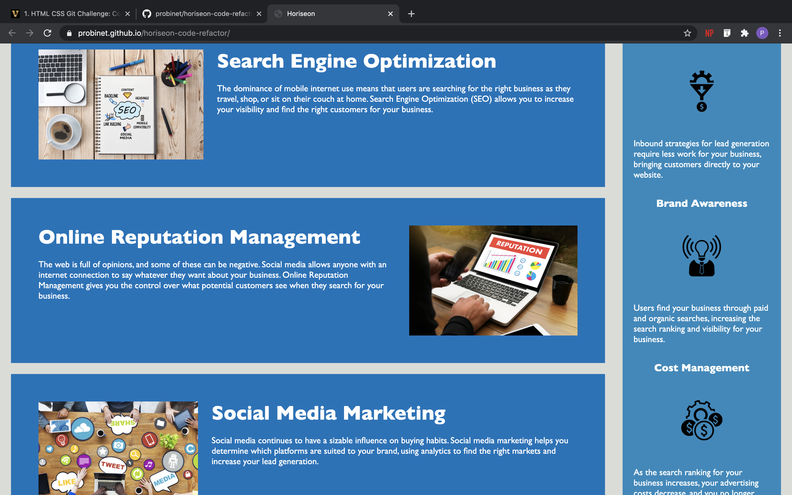

# Horiseon Code Refactor

The goal of this assesment was to clean up the HTML and CSS to ensure the the webpage meets accessibility standards. 

GitHub URL: https://probinet.github.io/horiseon-code-refactor/
GitHub Repository: https://github.com/probinet/horiseon-code-refactor

##Changes Made to The HTML

1. Changed the title to the name of the company, "Horiseon".
2. The "div" on line 11 of the original HTMl was changed to a "header" tag. 
3. The "div" tag on line 15 was changed to a "nav" tag.
4. The "id" for the three links (Search Engine Optimization, Online Reputation Management and Social Media Marketing ), were changed to avoid confusion with the classes of the same names.
5. The div containing the hero class was changed to a "section" tag.
6. The divs containing the id's "seo-content", "online-content" and "social-content" were changed to article tags.
7. The div containing the class "benefits" was changed to a section tag.
8. The divs for the benefits were changed to article tags.
9. In order to follow a semantic structure, the "h2" tag within the footer was changed to a "h4" tag.
10. Comments were also added to show the Navigation, Hero, What We Do, Benefits, and Footer sections.

##Changes Made to The CSS

1. Because the "header" class was removed, I didn't need the ".header" anymore.
2. The classes from ".search-engine-optimization" to ".social-media-marketing h2" were moved up in the style sheet to be included with the other "What We Do Section" styles.
3. Comments were added to show which styles go with which section.

##Screenshots

 

